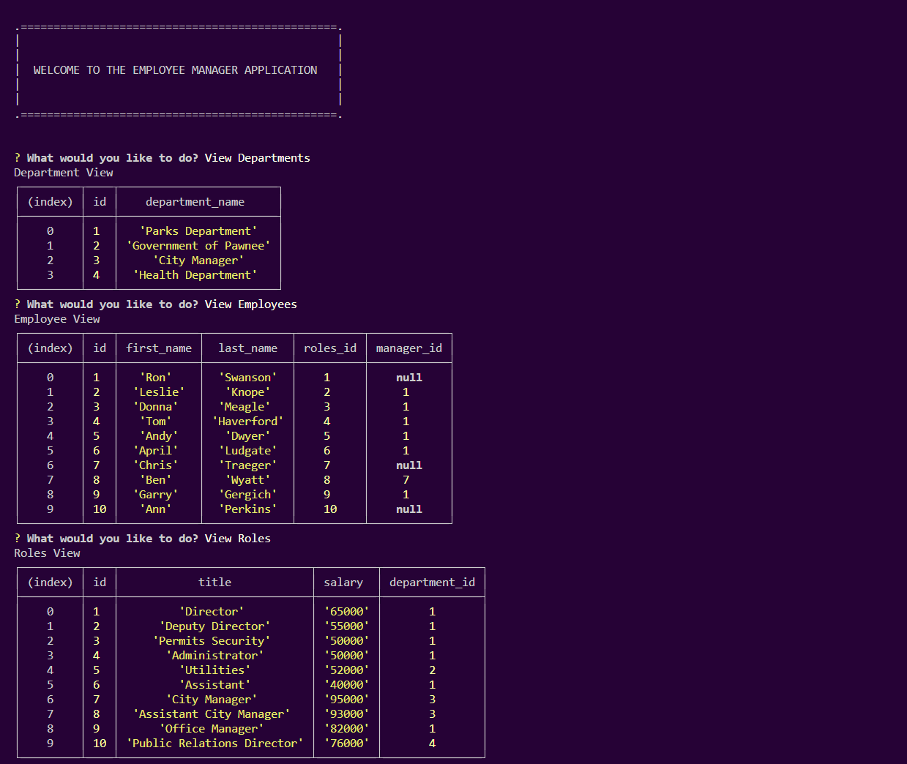

# Employee Tracker

## Description
This application is designed so that all employees, managers, departments, roles, salaries, and ids can be viewed in one place. Users also have the ability to update employee roles using this application. The application was built using MySQL and Inquirer.

## Table of Contents
- [Mockup](#mockup)
- [Installation](#installation)
- [Usage](#usage)
- [License](#license)
- [Contributing](#contributing)
- [Tests](#tests)
- [GitHub](#github)
- [Email](#email)
- [Instructions](#instructions)

## Mockup

## Installation
[MySQL](https://dev.mysql.com/downloads/mysql/) and [Inquirer](https://www.npmjs.com/package/inquirer/v/8.2.4) will have to be installed through the terminal in order to run this application.

## Usage
For managers to be able to easily view and update information about their employees.

## License
MIT

## Contributing
Email me at the address listed below.

## Tests
Run node server.js and try the different options to test.

## GitHub
GitHub: https://github.com/caitlinramsey

## Email
Email: caitlinramsey@outlook.com

## Instructions 
Please email me with any questions.

## Walkthrough Video
Video: <a href="https://drive.google.com/file/d/11-CLwpNzczoGF8fkAh-VjRQTGquNHleA/view" target="_blank">Click Here</a> to view the walkthrough video.